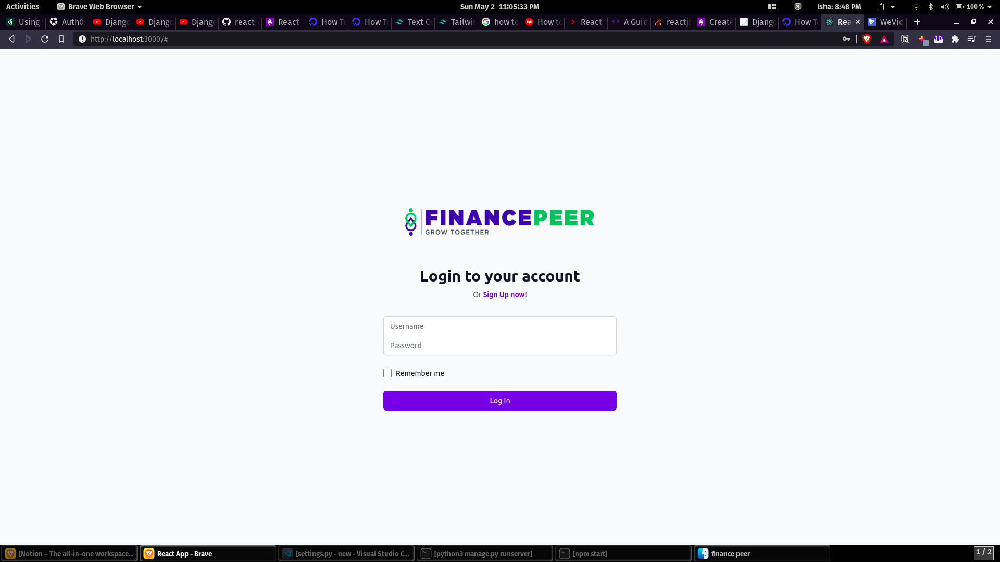
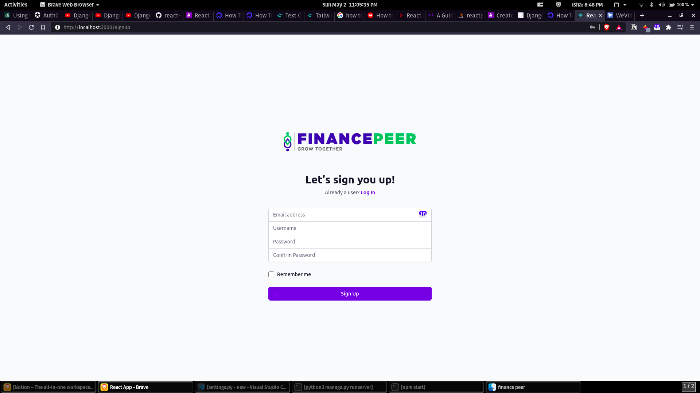
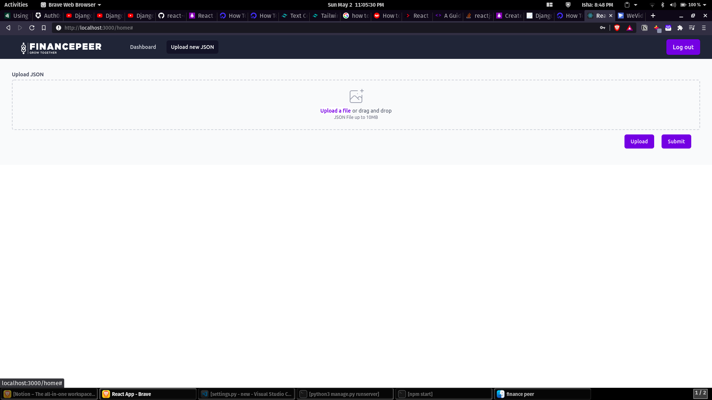
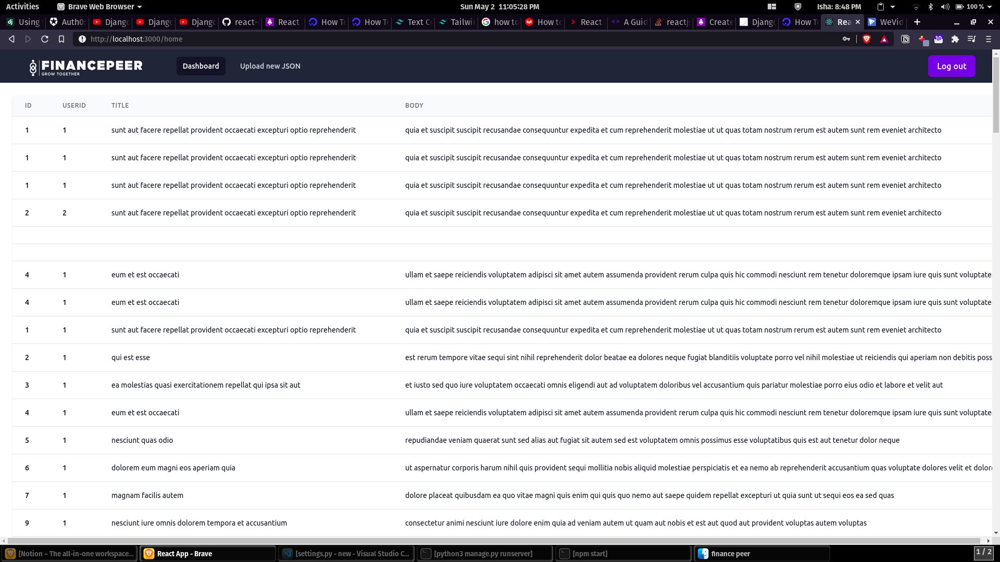

# Financepeer Task

    Hasir Mushtaq
    UG3 B.Tech ESE
    2018102049

Github Link :
https://github.com/ragnar48h/fp-task

Video Link :
https://drive.google.com/file/d/17E8lebAqBwCUVAa7pqkxFHIlNodkbAvc/view?usp=sharing

# Database used :  
`PostgreSQL`

# Back End used:
`Django`

# Front End used :
`React JS`


The GitHub repo contains the complete frontend and backend code, which implements a simple authentication system, JSON file upload section and a section to display data fetched from the database.

## Dependencies Required: 

a) python3 needs to be installed.

b) pip3 also needs to be present.

c) django need to be installed

d) pipenv also need to be installed
```
pip3 install pipenv
```

## Execution:

### For backend execution
1)  First navigate to backend folder and start the virtual environment:
```
pipenv shell
```
2)  Then install django into the virtual environment.
```
pipenv install django
```

3) Then install django rest and cors
```
pipenv install djangorestframework django-cors-headers
```
4)  Then
```
python manage.py migrate
python manage.py runserver
```

This should prompt you to start backend server on http://127.0.0.1:8000/

### For frontend execution
1)  First navigate to frontend folder:
```
npm install
```

2)  Then you might have to do, to install Tailwind CSS:
```
npm uninstall tailwindcss postcss autoprefixer
npm install tailwindcss@latest postcss@latest autoprefixer@latest

npx tailwindcss init -p

npm uninstall tailwindcss postcss autoprefixer
npm install tailwindcss@npm:@tailwindcss/postcss7-compat postcss@^7 autoprefixer@^9
```

3) Then just do:
```
npm start
```
Then open the link : http://localhost:3000/ to run frontend as shown in the above video.

## Screenshots:
<p float="left" >
  
  
  
  
</p>